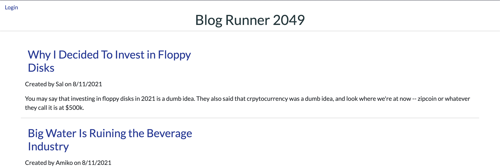
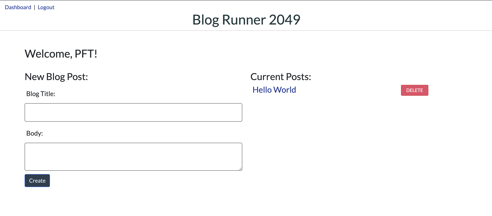

# Tech Blog

## Description 
- This application is a blog hosted on Heroku. 
- It's purpose is to be an only repository of various articles. 

## How To Use
- First, go to https://tech-blog-radams017.herokuapp.com/
- Create an account if you have not logged in before. 
- Once you create an account it will automatically bring you to your profile dashboard. 
- From there, you can create a blog post. Once you create a post, it will list your post on the Profile Dashboard as "Current Posts". 
- You can also see every post submitted on the site on the Home Page. 
- You can update posts by going into the post itself.
- You can delete posts by click the red "delete" button next to the post. 

## Screenshot

## License
MIT